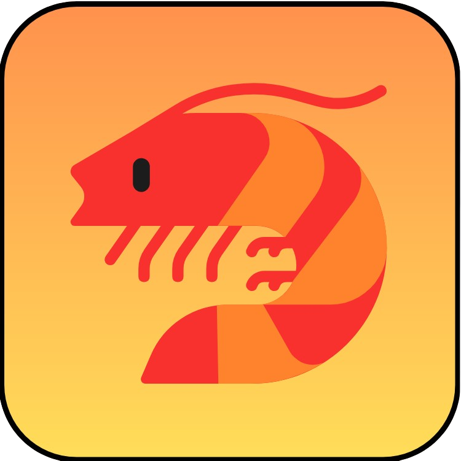

	

	
     
    <strong>SQIMP</strong>

	
    &nbsp
    
</a>
    

## 👀 Features
- Easy to use UI
- Supports multi-system emulation
- Integrated QEMU disk image creation tool
- Supports English and Korean
  
## ⚠ Warning!
- This project is currently in development so there is **NO** release!

## 📜 Information about using this project
- Sqimp Project is licensed under MIT License, check [LICENSE](https://github.com/RedBe-an/Sqimp/blob/main/LICENSE) for full information.
